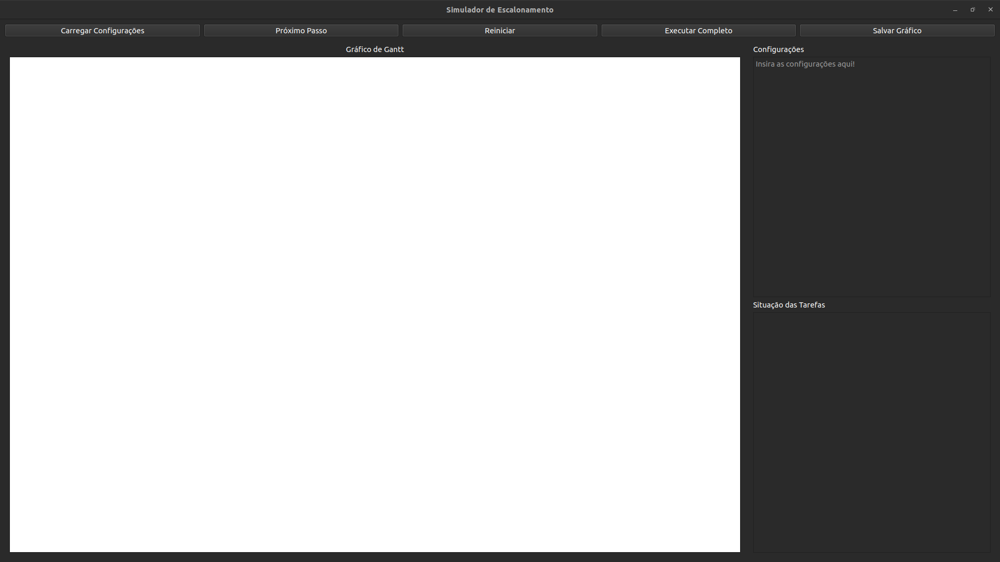
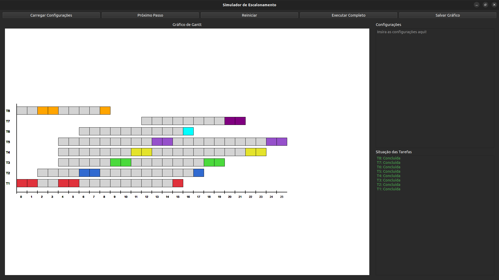

# 🤖 Simulador de Escalonamento de CPU

Este projeto é um simulador visual de algoritmos de escalonamento de CPU, permitindo ao usuário configurar tarefas, algoritmos e visualizar a execução passo a passo através de um gráfico de Gantt.

## 👥 Autores

  * **Gabriel Luzzi** (2516918)
  * **Wesley dos Santos Leite** (2581710)

-----

# 📸 Visualização do Sistema

O simulador apresenta uma interface limpa onde é possível acompanhar o estado do sistema antes e depois da execução.

**Antes da Execução:**


**Após a Execução:**


-----

## ✨ Funcionalidades Principais

A interface principal contém quatro botões de controle para gerenciar a simulação:

  * **Carregar Configurações:** Abre uma janela para definir o algoritmo, o quantum (se aplicável) e as tarefas a serem executadas. As configurações podem ser carregadas de um arquivo padrão (`config.txt`) ou inseridas manualmente.
  * **Próximo Passo:** Executa a simulação "tick" por "tick", permitindo uma análise detalhada de cada momento do escalonamento.
  * **Reiniciar:** Limpa o estado atual da simulação, apagando o gráfico de Gantt e redefinindo as tarefas para seu estado inicial.
  * **Execução Completa:** Executa a simulação inteira do início ao fim, exibindo o estado final com todas as tarefas concluídas.
  * **Salvar Gráfico:** Exporta o gráfico em formato .svg para.

-----

## ⚙️ Configuração da Simulação

Ao clicar em **"Carregar Configurações"**, o usuário pode definir os parâmetros da simulação de duas formas:

### 1\. Configuração Manual

O usuário pode inserir as configurações diretamente na tela de configuração.

  * **Linha 1:** Deve conter o **algoritmo** e o **quantum** (se o algoritmo exigir, como o Round Robin).

      * Exemplo: `FIFO;3`

  * **Linhas Subsequentes:** Cada linha representa uma tarefa e deve seguir o formato abaixo, com os campos separados por ponto e vírgula (`;`):

    `ID;Cor;Tempo de Ingresso;Duração;Prioridade`

      * **ID:** Identificador único da tarefa.
      * **Cor:** Cor para representar a tarefa no gráfico de Gantt (ex: "red", "blue", "\#FF0000").
      * **Tempo de Ingresso:** O "tick" em que a tarefa entra no sistema.
      * **Duração:** O tempo total de CPU necessário para a tarefa ser concluída.
      * **Prioridade:** O nível de prioridade da tarefa (usado por algoritmos de prioridade).

    **Exemplo de configuração manual:**

    ```
    FIFO;3
    T1;red;0;5;1
    T2;blue;1;3;2
    T3;green;2;8;1
    ```

### 2\. Configuração por Arquivo (Padrão)

Se nenhum dado for inserido manualmente na tela de configuração, o sistema carregará automaticamente as configurações do arquivo `config.txt`. Este arquivo deve seguir **exatamente o mesmo formato** da configuração manual.

-----

## 🚀 Instalação e Execução

Este projeto utiliza `make` para automatizar o processo de compilação, execução e limpeza, e um ambiente virtual (`venv`) para gerenciar as dependências.

### Pré-requisitos

Antes de começar, garanta que você tenha os seguintes softwares instalados:

  * Python 3 (e o módulo `venv`, que geralmente vem incluído)
  * `make`

### Passos para Execução

1.  **Clone o Repositório**

    ```bash
    git clone https://github.com/GabrielLuzziC/projeto_SO.git
    cd projeto_SO
    ```

2.  **Crie o Ambiente Virtual (Venv)**
    O `Makefile` está configurado para usar um ambiente virtual chamado `venv`.

    ```bash
    python3 -m venv venv
    ```

3.  **Ative o Ambiente Virtual**

    ```bash
    source venv/bin/activate
    ```

    *(No Windows, o comando pode ser `.\venv\Scripts\activate`)*

4.  **Instale as Dependências**
    Instale todos os pacotes Python necessários (como o PyInstaller) que estão listados no seu arquivo `requirements.txt`.

    ```bash
    pip install -r requirements.txt
    ```

    *(Se você ainda não tem um `requirements.txt`, crie um com `pip freeze > requirements.txt` depois de instalar suas dependências, como `pip install pyinstaller`)*

5.  **Compile o Aplicativo**
    Agora você pode usar o `make` para compilar. Este comando irá primeiro limpar builds antigos e depois criar o executável final na pasta `dist/`.

    ```bash
    make
    ```

    O executável será criado em `dist/app`.

6.  **Execute o Aplicativo**
    Após a compilação, você pode rodar o programa usando o comando `make` dedicado:

    ```bash
    make run
    ```

    ...ou executando o arquivo diretamente:

    ```bash
    ./dist/app
    ```

### 🎯 Comandos `make` Disponíveis

  * **`make`** (ou `make all`)
    Limpa os arquivos de compilação antigos e gera um novo executável. (Alvo padrão)

  * **`make build`**
    Gera o executável `dist/app` usando o PyInstaller. Não limpa os arquivos anteriores.

  * **`make run`**
    Executa o aplicativo `dist/app` (requer que você tenha executado `make` ou `make build` antes).

  * **`make clean`**
    Remove todos os arquivos e diretórios gerados pela compilação (pastas `dist` e `build`, arquivos `.spec` e `__pycache__`).

-----